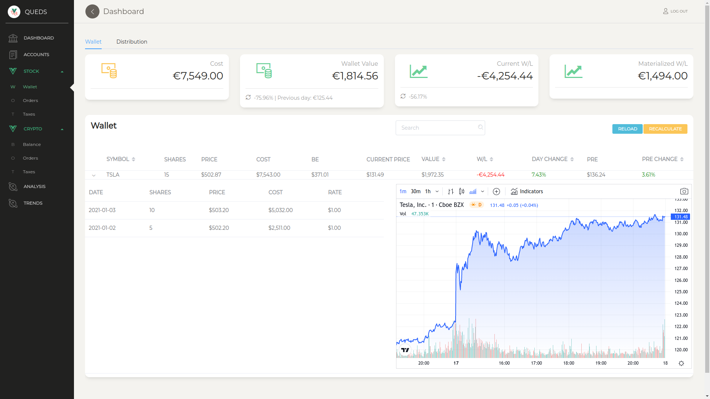
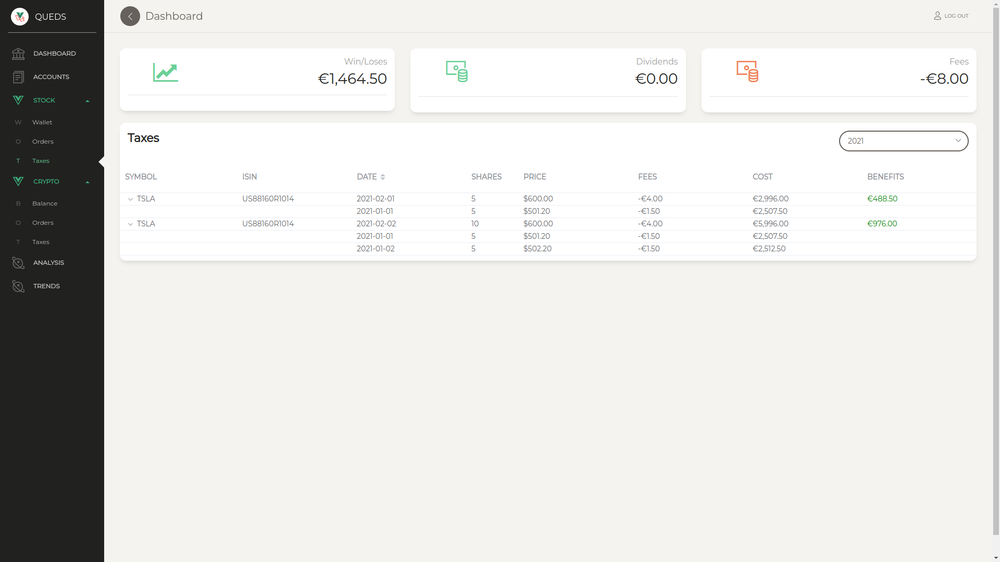
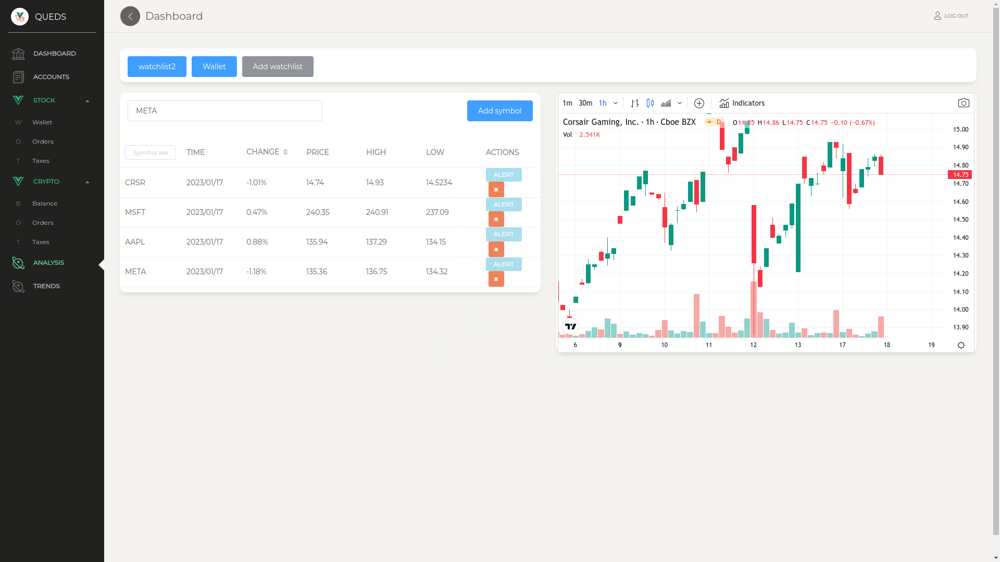

# Queds Finance
Queds Finance is a finance portfolio management tool that allows you to track your finance assets, including stock transactions, crypto transactions, and bank statements. It automatically reads data from various brokers, crypto exchanges, and banks, making it easier for you to manage your investments.


## Demo
Check out the demo at https://queds.fly.dev/overview

## Features
* Stock-Portfolio and Crypto-Portfolio tracking
* Wallet tracking with Session/Pre/Post market prices
* Tax calculation with FIFO
* Coin tracking with FIFO
* Watchlist for monitoring assets
* Automatic data import from Degiro, Clicktrade and InteractiveBrokers
* Automatic data import from exchanges: Bitstamp, Kraken, Bittrex, Binance and Kukoin
* TradingView graphs for visualizing asset performance
* Import broker/crypto data from CSV

## In progress
* Set price alerts via Telegram
* Dividends tracking
* Set default portfolio currency
* Investment fund tracking

## Table of Contents
1. [Getting Started](#getting-started)
2. [Initial steps](#initial-steps)
3. [Development](#development)

## Getting Started
To get started with Queds Finance, you can deploy the tool using docker-compose or install each component individually.

### Docker compose
Deploy everything with docker-compose (including external services: redis + nginx + timescaledb):
```
docker-compose build (also you can use --parallel)
docker-compose up
```
Check the VUE_APP_BACKEND_URL environment variable in docker-compose.yml. 

The database is created automatically via alembic migrations. To be sure, once everything is ready, apply migrations again.
```
docker-compose run migrate
```

## Initial steps
1. Visit http://0.0.0.0:6060
2. Create a user using the Register form
3. Add a broker/exchange account in Accounts view
4. Execute a read over the accounts
5. Check orders
6. Execute wallet calculation in order to generate the Wallet and the Tax report
7. Add stock to a watchlist

## Development
Queds Finance is built using Python, Vue, Redis, and Timescaledb. Here's an overview of the directory structure:

    .
    ├── api/ (flask app)
    ├── backend/ (worker) 
    ├── config/ (app configs)
    ├── frontend/ (vue web page)
    ├── models/ (DB models) 
    └── docker-compose.yml
    
### Configuration
Edit the configuration file `config/local.py` and set the parameters according to your local environment.
```
DEBUG = True

SQL_CONF = {
    'user': 'username',
    'password': 'password',
    'host': 'localhost',
    'port': '5432',
    'database': 'queds_local'
}

REDIS = {
    'host': 'localhost',
    'port': 6379
}
```
    
### Database
Create a database in Timescale and apply migrations:
```
BACKEND_SETTINGS=config.local alembic upgrade head
```

Create new migrations:
```
BACKEND_SETTINGS=conf.local alembic revision --autogenerate
```

#### With docker-compose
You can modify the database using the docker-compose. After the model modification, you can generate the new migrations with:
```
docker-compose run migrate /bin/bash
cd models && alembic revision --autogenerate
```

To downgrade a migration, use:
```
docker-compose run migrate /bin/bash
cd models && alembic downgrade -1
```

### API
To initialize the API, create a virtual environment and run:
```
cd api
pip install -r requirements.txt
BACKEND_SETTINGS=config.local python app.py run -h 0.0.0.0
```

Test the API:
```
BACKEND_SETTINGS=config.local python -m unittest
```

Finally, check API endpoints in Swagger: http://0.0.0.0:5000/api

Also you can visit the demo api at https://queds.fly.dev/api/

### Backend
Create a virtual environment and initialize a worker:
```
cd backends
pip install -r requirements.txt
BACKEND_SETTINGS=config.local python finance_reader/worker.py
```

Init test client:
```
BACKEND_SETTINGS=config.local python finance_reader/client.py
```

### Frontend
Init frontend:
```
cd frontend
npm install
npm install @vue/cli -g
npm run serve
```

Build:
```
npm run-script build
```

### Database management
You can access to the database using the docker-compose.


# Screenshots
Track your assets and monitor your portfolio performance.


Check your taxes and dividends.


Monitor your assets with the watchlist.

